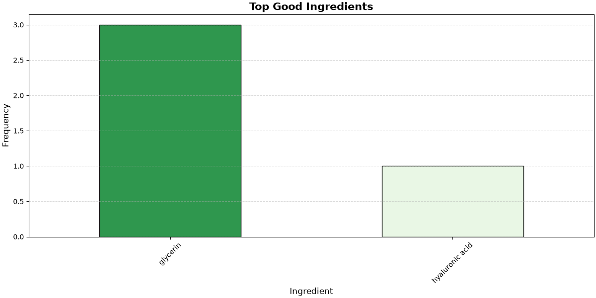
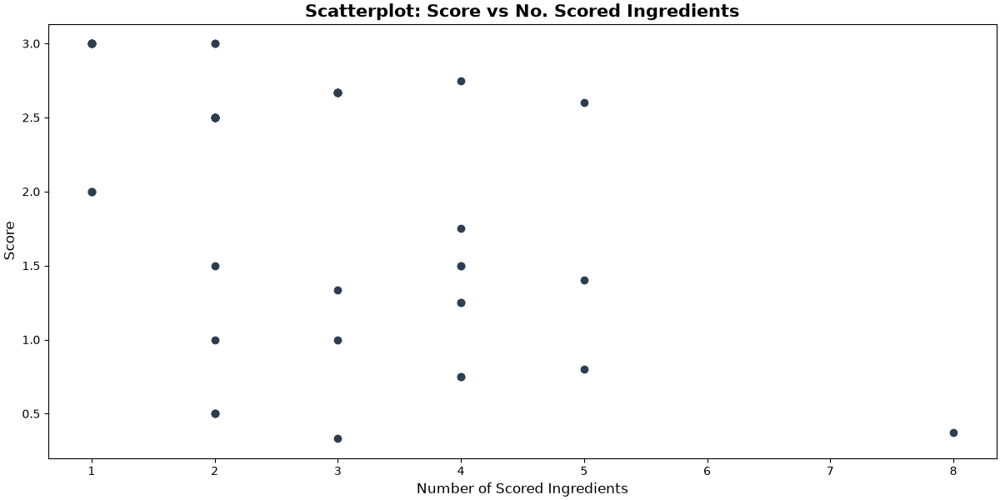
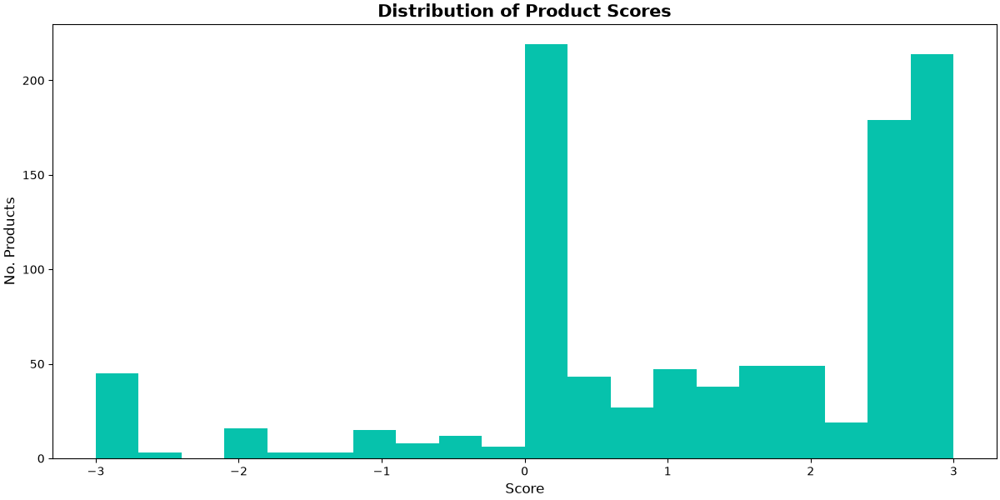

# Skincare-Recommendation-System
A Python-based recommendation system that suggests skincare products based on skin type, skin concern and product type.

## How It Works

- Takes user input (skin type, concern, product type)
- Scores 900+ products using a penalty/reward system
- Penalises irritating ingredients and rewards beneficial ones
- Normalises scores by number of scored ingredients
- Returns the top 3 personalised recommendations
- Generates visualisations

## Installation
- Clone the repository
- Navigate to the project root
- Install dependencies:
```bash
pip install -r requirements.txt
```

## Usage
```bash
python src/run.py
```

## Example
```text
--SKINCARE RECOMMENDATION SYSTEM--
Please input:
skin type (dry/oily/sensitive/normal):  sensitive
skin concern (acne/aging/redness/dehydration/dullness):  dehydration
product type (moisturiser/serum/oil/mist/balm/mask/peel/eye care/cleanser/toner/exfoliator):  toner
Data currently loading...
Data loaded
--TOP RECOMMENDATIONS--
1 . pixi rose tonic    Score: 3.0
This product is recommended because it contains:  {'hyaluronic acid', 'glycerin'}
2 . sukin hydrating mist toner ()   Score: 3.0
This product is recommended because it contains:  {'glycerin'}
3 . la roche-posay soothing lotion    Score: 3.0
This product is recommended because it contains:  {'glycerin'}
No bad ingredients found. Graph has not been created
```
graphs:
- Plot_Top_Good_Ingredients:




- Plot_Score_VS_Counts:




- Plot_Score_Distribution:



## Project Structure
```text
Skincare_Recommendation_System/
├── data/                        # CSV data files
├── graphs/                      # Output visualisations
├── src/                         # Python source code
│   ├── data_loader.py           # Loads and cleans data
│   ├── graph_visualiser.py         # creates charts
│   ├── ingredient_processor.py  # Scores ingredients
│   ├── recommender.py           # Ranks products
│   └── run.py                   # Main entry point
├── requirements.txt
└── README.md
```

## Author
Beatrice Ursachi